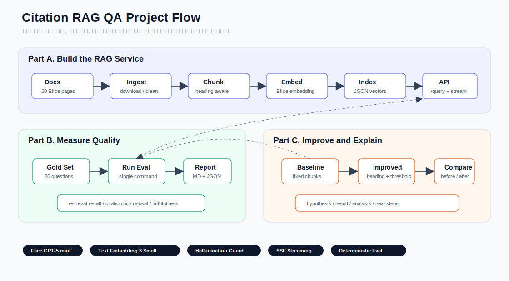
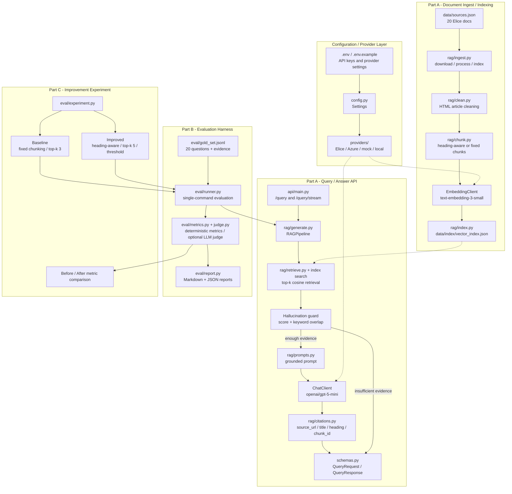

# Elice AI Cloud Citation RAG QA

Elice AI Cloud 공식 문서 corpus를 기반으로 구축한 citation 기반 RAG QA 서비스입니다.

RAG 서비스는 통제된 데모 환경에서는 쉽게 정상 동작해 보일 수 있지만, 실제 사용 환경에서는 문서 범위 밖 질문, 모호한 질문, 검색 실패, 근거 부족, citation 누락 같은 edge case에서 품질이 크게 흔들릴 수 있습니다.

이 프로젝트는 이러한 실패 지점을 명시적으로 다루기 위해 다음 세 가지를 우선순위로 두었습니다.

1. 답변이 어떤 문서 근거에 의해 생성되었는지 citation으로 추적할 수 있어야 한다.
2. 검색된 문맥에 충분한 근거가 없을 경우, 억지로 답변하지 않고 정보 불충분 상태를 반환해야 한다.
3. 위 동작이 주관적인 판단이 아니라 Gold Set 기반 evaluation harness로 반복 측정 가능해야 한다.

Corpus는 Elice AI Cloud 공식 문서를 사용했습니다. 공개 오픈소스 문서나 위키 문서도 후보로 고려했지만, 이 프로젝트는 AI Cloud 환경에서 모델 호출, 인스턴스, 크레딧, API 키, 엔드포인트 같은 실제 운영 흐름을 문서 기반으로 질의응답하는 것을 목표로 했습니다. 따라서 서비스 도메인과 가장 가까운 공식 문서를 corpus로 선택하는 것이 citation 검증, 재현성, hallucination 관찰 측면에서 더 적합하다고 판단했습니다.

Repository: [skytin1004/elice-ai-cloud-rag-qa](https://github.com/skytin1004/elice-ai-cloud-rag-qa)

## 목차

1. [시스템 아키텍처](#1-시스템-아키텍처)
2. [실행 방법](#2-실행-방법)
3. [Dataset 선택 근거](#3-dataset-선택-근거)
4. [모델 및 기술 스택 선정 근거](#4-모델-및-기술-스택-선정-근거)
5. [Part A. RAG QA Service](#5-part-a-rag-qa-service)
6. [Part B. Evaluation Harness](#6-part-b-evaluation-harness)
7. [Part C. 개선 실험](#7-part-c-개선-실험)
8. [핵심 Design Decision 및 Trade-off](#8-핵심-design-decision-및-trade-off)
9. [현재 한계점과 알려진 이슈](#9-현재-한계점과-알려진-이슈)
10. [향후 개선 과제](#10-향후-개선-과제)

## 1. 시스템 아키텍처





이 구조에서 Part A는 서비스 동작 경로이고, Part B는 같은 RAG pipeline을 Gold Set에 반복 실행하는 품질 측정 경로입니다. Part C는 Part B의 평가 파이프라인을 그대로 사용해 baseline과 개선안을 비교합니다. 즉 API 구현, evaluation, experiment가 서로 분리되어 있지만 같은 core RAG pipeline을 공유하도록 구성했습니다.

| PDF 요구사항 | 코드 위치 | 역할 |
|---|---|---|
| 문서 Ingest Pipeline | `src/elice_rag/rag/ingest.py`, `clean.py` | source manifest를 읽고 HTML 문서를 다운로드 및 정제 |
| Chunking 전략 | `src/elice_rag/rag/chunk.py` | heading-aware chunking과 fixed-size baseline 제공 |
| Embedding 및 Index | `src/elice_rag/providers/*`, `src/elice_rag/rag/index.py` | embedding provider 호출, JSON vector index 생성 및 검색 |
| 검색 및 답변 생성 API | `src/elice_rag/api/main.py`, `src/elice_rag/rag/generate.py` | `/query`, `/query/stream`, RAGPipeline 실행 |
| Citation 제공 | `src/elice_rag/rag/citations.py`, `schemas.py` | source URL, title, heading, chunk ID 반환 |
| Hallucination 방지 | `src/elice_rag/rag/generate.py` | score threshold와 keyword overlap 기반 `insufficient_context` 반환 |
| Request / Response Schema | `src/elice_rag/rag/schemas.py` | `QueryRequest`, `QueryResponse`, citation, retrieved context schema |
| Gold Set | `eval/gold_set.jsonl`, `src/elice_rag/eval/gold_set.py` | 20개 질의와 기대 근거 로드 |
| Metric 및 Report | `src/elice_rag/eval/metrics.py`, `judge.py`, `report.py` | deterministic metric, optional LLM judge, Markdown/JSON report 생성 |
| Before / After 실험 | `src/elice_rag/eval/experiment.py` | fixed baseline과 heading-aware 개선안 비교 |

Provider 의존성은 `ChatClient`, `EmbeddingClient` 인터페이스 뒤에 두었습니다. Elice endpoint 구조, Azure 설정, mock provider, local embedding fallback이 RAG core logic으로 퍼지지 않도록 하기 위한 결정입니다.

## 2. 실행 방법

### 2.1 설치

```powershell
python -m pip install -e .[dev]
```

### 2.2 환경 변수 설정

```powershell
Copy-Item .env.example .env
```

Elice Serverless 기준 최종 실행 환경은 다음과 같습니다.

```env
LLM_PROVIDER=elice
EMBEDDING_PROVIDER=elice
ELICE_API_KEY=
ELICE_BASE_URL=https://mlapi.run/{chat-endpoint-id}/v1
ELICE_CHAT_MODEL=openai/gpt-5-mini
ELICE_EMBEDDING_BASE_URL=https://mlapi.run/{embedding-endpoint-id}
ELICE_EMBEDDING_MODEL=openai/text-embedding-3-small
```

`ELICE_BASE_URL`은 chat completion용 OpenAI-compatible `/v1` base URL입니다. `ELICE_EMBEDDING_BASE_URL`은 embedding endpoint의 root URL 또는 `/v1` base URL을 사용할 수 있으며, provider adapter에서 `/v1/embeddings` 호출 URL로 정규화합니다.

> [!NOTE]
>
> Provider는 모델 호출부를 교체 가능하게 두기 위해 분리했습니다.
>
> - `LLM_PROVIDER`: `elice`, `azure`, `mock`
> - `EMBEDDING_PROVIDER`: `elice`, `azure`, `local`, `mock`
>
> Azure provider는 Elice credit과 endpoint가 준비되기 전에도 같은 RAG pipeline을 먼저 검증하기 위해 추가했습니다. Azure OpenAI를 사용하려면 `LLM_PROVIDER=azure`, `EMBEDDING_PROVIDER=azure`로 설정하고 `AZURE_OPENAI_API_KEY`, `AZURE_OPENAI_ENDPOINT`, `AZURE_OPENAI_API_VERSION`, `AZURE_OPENAI_CHAT_DEPLOYMENT_NAME`, `AZURE_OPENAI_EMBEDDING_DEPLOYMENT_NAME`을 설정해야 합니다.
>
> `mock`과 `local` provider는 비용 없이 unit test와 CI를 반복 실행하기 위한 fallback입니다. 최종 제출 report는 Elice Serverless chat과 Elice embedding 조합을 기준으로 작성했습니다.

비용 없이 테스트 또는 CI를 실행할 때는 다음 fallback 조합을 사용해서 테스트 할 수 있도록 설계했습니다.

```env
LLM_PROVIDER=mock
EMBEDDING_PROVIDER=local
```

### 2.3 문서 수집 및 Ingest

한 번에 실행:

```powershell
python -m elice_rag.rag.ingest all
```

단계별 실행:

```powershell
python -m elice_rag.rag.ingest download
python -m elice_rag.rag.ingest process --strategy heading
python -m elice_rag.rag.ingest index
```

### 2.4 서버 실행

```powershell
python -m uvicorn elice_rag.api.main:app --reload
```

### 2.5 질의응답 API 호출

일반 질의:

```powershell
Invoke-RestMethod `
  -Method Post `
  -Uri http://127.0.0.1:8000/query `
  -ContentType 'application/json' `
  -Body '{"question":"Serverless API Key는 어디에서 발급하나요?","top_k":5,"model":"openai/gpt-5-mini"}'
```

Streaming 질의:

```powershell
curl -N `
  -X POST http://127.0.0.1:8000/query/stream `
  -H "Content-Type: application/json" `
  -d "{\"question\":\"Serverless 모델은 어떤 방식으로 사용할 수 있나요?\",\"top_k\":5}"
```

### 2.6 Evaluation 실행

Gold Set 전체 평가:

```powershell
python -m elice_rag.eval.runner --gold eval/gold_set.jsonl --out eval/reports/elice-final.md --label elice-final
```

LLM-as-a-judge 보조 평가 포함:

```powershell
python -m elice_rag.eval.runner --gold eval/gold_set.jsonl --out eval/reports/elice-final-judge.md --label elice-final-judge --judge
```

Part C before/after 실험:

```powershell
python -m elice_rag.eval.experiment --out eval/reports/elice-experiment.md --baseline-out eval/reports/elice-baseline-fixed.md --improved-out eval/reports/elice-improved-heading.md
```

Unit test:

```powershell
python -m pytest
```

## 3. Dataset 선택 근거

선택한 corpus는 Elice AI Cloud 공식 문서 20개입니다. 문서 범위는 ML API, Serverless, API Key, 모델 라이브러리, Runbox, DataHub, FAQ를 포함합니다. 수집 대상은 `data/sources.json`에 URL manifest로 관리합니다.

| Path | 설명 |
|---|---|
| `data/sources.json` | 수집 대상 Elice AI Cloud 공식 문서 URL manifest |
| `data/raw/` | 다운로드된 원문 문서 JSON |
| `data/processed/chunks.jsonl` | 정제 및 chunking 결과 |
| `data/index/vector_index.json` | embedding vector와 metadata를 저장한 local index |

선정 이유:

- 과제에서 실제로 다루는 Elice AI Cloud와 직접 연결됩니다.
- 답변 가능한 질문과 답변하면 안 되는 질문을 모두 만들 수 있습니다.
- source URL을 citation과 evaluation의 기준으로 사용할 수 있습니다.
- 실행 시 자동 다운로드할 수 있어 재현성이 좋습니다.

Trade-off:

- 장점: 공식 문서라 근거성과 검증 가능성이 높습니다.
- 단점: Elice 문서에 특화되어 open-domain QA 성능을 대표하지는 않습니다.

## 4. 모델 및 기술 스택 선정 근거

### 4.1 모델 선정

최종 chat model은 Elice Serverless `openai/gpt-5-mini`입니다.

`gpt-5-nano`도 비용과 latency 면에서 장점이 있지만, 제출용 RAG QA에서는 문서 근거를 읽고 답변을 안정적으로 구성하는 능력을 더 중요하게 보았습니다. 그래서 기본 모델은 `gpt-5-mini`로 선택했습니다.

최종 embedding model은 Elice Serverless `openai/text-embedding-3-small`입니다.

Text Embedding 3 Small을 선택한 이유:

- corpus 규모가 작고 도메인이 좁습니다.
- Large 모델보다 비용이 낮습니다.
- local deterministic embedding보다 semantic retrieval 품질을 기대할 수 있습니다.
- Elice AI Cloud를 chat뿐 아니라 embedding에도 실제로 사용해 볼 수 있습니다.

초기 개발에서는 Elice credit이 준비되기 전 Azure OpenAI chat과 local deterministic embedding으로 먼저 end-to-end loop를 검증했습니다. 최종 제출 기준에서는 Elice chat과 Elice embedding으로 전환했습니다.

### 4.2 기술 스택 선정

| 기술 | 선택 이유 | 대안 및 trade-off |
|---|---|---|
| Python | 텍스트 처리, embedding 실험, eval script 작성에 적합합니다. | TypeScript는 API 서비스 타입 안정성에 장점이 있지만, 이 과제에서는 RAG/eval 실험 속도를 우선했습니다. |
| FastAPI | Pydantic 기반 request/response schema와 OpenAPI 문서를 자동으로 제공합니다. | Flask는 가볍지만 schema 관리를 직접 해야 합니다. |
| 직접 구현한 RAG pipeline | chunking, retrieval, citation, refusal, eval metric의 내부 동작을 설명하기 위해 선택했습니다. | LangChain, LlamaIndex, Semantic Kernel은 빠른 prototype에는 좋지만, 이번 과제에서는 black box처럼 보이지 않는 것이 더 중요했습니다. |
| local JSON vector index | 20개 문서 규모에서는 충분하고, 설치 없이 index 구조를 직접 확인할 수 있습니다. | ChromaDB, FAISS, pgvector는 대규모 검색에는 더 적합하지만 제출 환경 setup이 무거워질 수 있습니다. |
| deterministic eval metric | 비용 없이 반복 가능한 regression signal을 얻기 위해 선택했습니다. | semantic correctness와 answer groundedness를 완전히 판단하지는 못합니다. |
| optional LLM-as-a-judge | deterministic metric이 놓치는 answer quality와 groundedness 문제를 보조적으로 확인하기 위해 추가했습니다. | judge prompt 안정성, 비용, model bias, human alignment 관리를 별도로 설명해야 합니다. |

## 5. Part A. RAG QA Service

### 5.1 Ingest Pipeline

구현 위치:

- `src/elice_rag/rag/ingest.py`
- `src/elice_rag/rag/clean.py`
- `src/elice_rag/rag/chunk.py`
- `src/elice_rag/rag/index.py`

처리 흐름:

1. `data/sources.json`에서 source URL을 읽습니다.
2. HTML을 다운로드합니다.
3. Docusaurus 문서의 article body 중심으로 본문을 정제합니다.
4. heading 정보를 보존하며 chunk를 생성합니다.
5. chunk별 embedding을 생성합니다.
6. source URL, title, heading, chunk ID, text, vector를 local JSON index에 저장합니다.

### 5.2 Chunking Strategy

기본 chunking은 heading-aware 전략입니다. Elice help 문서는 제목과 섹션 구조가 비교적 명확하므로, heading을 보존하면 citation에 어느 섹션을 근거로 삼았는지 함께 제공할 수 있습니다.

대안은 fixed-size chunking입니다. fixed-size 방식은 단순하고 chunk 크기가 안정적이지만 문서 구조를 끊을 수 있습니다. heading-aware 방식은 사람이 읽는 근거성은 좋지만, heading 구조에 따라 chunk 크기가 불균형해질 수 있습니다. 이 trade-off는 Part C에서 baseline과 improved setting으로 비교했습니다.

### 5.3 Embedding and Index

Embedding provider는 Elice Serverless `openai/text-embedding-3-small`입니다. Index는 local JSON vector index와 cosine similarity search를 사용합니다.

이 선택은 과제 규모와 재현성을 기준으로 결정했습니다. 20개 문서 corpus에서는 별도 vector DB 없이도 충분하고, index 파일에 어떤 metadata와 vector가 들어가는지 직접 확인할 수 있습니다. 다만 production 규모에서는 pgvector, ChromaDB, FAISS 또는 managed vector DB로 바꾸는 것이 적절합니다.

### 5.4 Retrieval and Answer Generation

질문이 들어오면 질문 embedding을 생성하고, index의 chunk embedding과 cosine similarity를 계산해 top-k chunk를 검색합니다. 검색된 chunk는 prompt context로 들어가며, 답변 생성에는 Elice Serverless `openai/gpt-5-mini`를 사용합니다.

Provider 차이는 `ChatClient`, `EmbeddingClient` adapter에서 처리합니다. Elice GPT-5 mini는 일부 요청에서 `max_tokens` 대신 `max_completion_tokens`가 필요했고, reasoning token이 completion budget에 포함되는 것으로 보여 completion budget을 1600으로 늘렸습니다. 이 로직은 RAG core가 아니라 Elice provider adapter에 격리했습니다.

### 5.5 Citation and Hallucination Guard

Citation은 source URL, title, heading, chunk ID를 포함합니다. URL은 원문 확인용이고, heading은 문서 내 위치를 찾기 위한 정보입니다. chunk ID는 디버깅과 eval에서 같은 chunk를 추적하기 위해 사용합니다.

검색 결과가 없거나 score threshold와 keyword overlap guard를 통과하지 못하면 LLM을 호출하지 않고 `insufficient_context`를 반환합니다.

```json
{
  "status": "insufficient_context",
  "answer": "제공된 문서에서 해당 내용을 확인할 수 없습니다.",
  "citations": [],
  "confidence": "low"
}
```

이 방식은 보수적입니다. 문서 표현과 질문 표현이 다르면 답변 가능한 질문도 거절할 수 있습니다. 그래도 문서 기반 QA에서는 근거 없는 답변보다 답변 보류가 더 안전하다고 판단했습니다.

### 5.6 Request / Response Schema

#### `POST /query`

Request:

```json
{
  "question": "Serverless API Key는 어디에서 발급하나요?",
  "top_k": 5,
  "model": "openai/gpt-5-mini"
}
```

`model`은 optional입니다. 생략하면 `ELICE_CHAT_MODEL` 값을 사용합니다.

Response:

```json
{
  "status": "answered",
  "answer": "...",
  "citations": [
    {
      "source_url": "https://help.elice.io/help/docs/elicecloud/ml-api/api-key",
      "title": "API Key 관리하기",
      "heading": "API Key 발급",
      "chunk_id": "ml-api-api-key-000-..."
    }
  ],
  "confidence": "high",
  "model": "openai/gpt-5-mini",
  "retrieved_context": [
    {
      "chunk_id": "...",
      "source_url": "...",
      "title": "...",
      "heading": "...",
      "text": "...",
      "score": 0.42
    }
  ]
}
```

#### `POST /query/stream`

동일한 request schema를 사용하며 `text/event-stream` 형식으로 응답합니다.

```text
event: metadata
data: {"status":"answering","citations":[...],"confidence":"high","model":"openai/gpt-5-mini"}

event: token
data: {"text":"Serverless"}

event: done
data: {"status":"answered","answer":"...","citations":[...],"confidence":"high","retrieved_context":[...],"model":"openai/gpt-5-mini"}
```

## 6. Part B. Evaluation Harness

### 6.1 Gold Set 구성 방식

`eval/gold_set.jsonl`에 20개 질의를 작성했습니다. 질문은 Elice 공식 문서를 직접 확인한 뒤 문서 기반으로 만들었습니다.

| Type | Count | 의도 |
|---|---:|---|
| factual | 6 | API Key, Serverless, Runbox, DataHub, ML API 관련 직접 사실 확인 |
| procedural | 5 | 키 발급, 인스턴스 생성/관리 같은 절차형 질문 |
| comparison | 3 | Serverless, Runbox, Dedicated, FAQ 문서 간 비교 |
| summary/inference | 4 | 요약 또는 가벼운 추론이 필요한 생성형 질문 |
| refusal | 2 | corpus에 답이 없는 질문에서 응답 거절 확인 |

각 항목에는 `expected_sources` 또는 acceptance criteria를 넣었습니다.

### 6.2 Metric 정의

| Metric | 측정 대상 | 선택 이유 |
|---|---|---|
| `retrieval_recall_at_k` | expected source가 top-k 검색 결과에 포함되는지 | retrieval 실패와 generation 실패를 분리하기 위해 |
| `citation_hit_rate` | 최종 citation에 expected source가 포함되는지 | citation은 사용자가 답변을 검증하는 핵심 장치이기 때문에 |
| `refusal_accuracy` | 답이 없는 질문을 `insufficient_context`로 반환하는지 | hallucination 방지 동작을 직접 확인하기 위해 |
| `faithfulness` | response status, citation, retrieved context, expected source hit 기반 proxy | LLM judge 없이 회귀 신호를 얻기 위해 |
| `judge_groundedness` | LLM judge가 답변의 factual claim이 retrieved context로 뒷받침되는지 평가 | deterministic proxy가 놓치는 unsupported claim을 찾기 위해 |
| `judge_correctness` | LLM judge가 acceptance criteria 충족 여부를 평가 | URL hit만으로 판단하기 어려운 semantic correctness를 확인하기 위해 |
| `judge_score` | groundedness와 correctness 평균 | 보조적인 answer quality signal로 사용하기 위해 |

기본 평가는 deterministic metric을 사용합니다. 이 경로는 비용이 들지 않고, 같은 index와 같은 response에 대해 반복 가능한 regression signal을 제공합니다. 다만 deterministic metric은 expected source URL이 맞았는지에는 강하지만, 답변이 acceptance criteria를 의미적으로 충분히 만족했는지나 citation이 답변의 모든 factual claim을 뒷받침하는지는 완전히 판단하지 못합니다.

이를 보완하기 위해 `--judge` 옵션으로 LLM-as-a-judge 보조 평가를 추가했습니다. Judge는 고정 rubric, JSON output schema, `temperature=0.0`, model/version 기록, retrieved context 기반 평가를 사용합니다. Judge 결과는 최종 pass/fail의 단독 기준이 아니라 deterministic metric이 높게 나온 사례 중에서도 답변 품질이나 acceptance criteria 충족이 부족한 사례를 찾기 위한 보조 신호로 사용합니다.

Judge prompt의 신뢰성과 일관성은 다음 방식으로 관리했습니다.

- Judge는 retrieved context, citation, answer, acceptance criteria만 사용하고 외부 지식은 사용하지 않도록 지시했습니다.
- 출력은 `groundedness`, `correctness`, `judge_pass`, `rationale` JSON schema로 고정했습니다.
- sampling 변동을 줄이기 위해 `temperature=0.0`으로 호출합니다.
- report에 judge model, provider, max context chars, 실행 commit을 기록합니다.
- Human alignment는 Gold Set의 acceptance criteria를 사람이 직접 작성하고, judge rationale을 함께 검토하는 방식으로 맞췄습니다.

### 6.3 Evaluation 실행 방식

Gold Set 전체 평가:

```powershell
python -m elice_rag.eval.runner --gold eval/gold_set.jsonl --out eval/reports/elice-final.md --label elice-final
```

LLM-as-a-judge 포함 평가:

```powershell
python -m elice_rag.eval.runner --gold eval/gold_set.jsonl --out eval/reports/elice-final-judge.md --label elice-final-judge --judge
```

최종 Elice 평가 결과:

| Metric | Score |
|---|---:|
| retrieval_recall_at_k | 0.9444 |
| citation_hit_rate | 0.8889 |
| refusal_accuracy | 1.0000 |
| faithfulness | 0.9250 |

이 결과는 Elice Serverless `openai/gpt-5-mini`와 Elice Text Embedding 3 Small `openai/text-embedding-3-small` 조합으로 Gold Set 20문항 전체를 실행한 결과입니다.

LLM-as-a-judge 보조 평가 결과:

| Metric | Score |
|---|---:|
| judge_groundedness | 0.8500 |
| judge_correctness | 0.6750 |
| judge_score | 0.7625 |
| judge_pass_rate | 0.6000 |

Judge 결과는 deterministic metric보다 엄격했습니다. 예를 들어 retrieved source와 citation은 맞았지만 acceptance criteria 일부를 누락한 답변은 deterministic faithfulness에서는 높게 잡히고, judge correctness에서는 부분 감점되었습니다. 이 차이는 LLM-as-a-judge를 최종 단독 점수로 쓰기보다, Gold Set 개선과 answer quality 분석을 위한 보조 신호로 해석했습니다.

### 6.4 Evaluation 재현성

Report에는 다음 정보를 기록합니다.

- provider
- model/deployment
- embedding provider/model
- top-k
- min score
- git commit
- git branch
- Python version
- seed policy
- judge policy
- judge model and rubric policy, when `--judge` is enabled

현재 retrieval과 deterministic metric 계산은 random sampling을 사용하지 않습니다. Report에는 `seed: not used; deterministic retrieval/eval path`가 기록됩니다. `--judge`를 켠 경우 judge model과 `temperature=0.0`, 고정 rubric 사용 여부가 함께 기록됩니다.

### 6.5 Metric의 한계

| Metric | 한계 |
|---|---|
| `retrieval_recall_at_k` | 같은 URL 안의 잘못된 섹션까지는 구분하지 못합니다. |
| `citation_hit_rate` | citation이 답변의 모든 문장을 뒷받침하는지는 판단하지 못합니다. |
| `refusal_accuracy` | refusal 질문 수와 품질에 의존합니다. |
| `faithfulness` | deterministic proxy라 semantic correctness를 완전히 판단하지 못합니다. |
| `judge_score` | judge model bias, prompt 민감도, 동일 계열 모델 사용에 따른 self-preference 가능성이 있습니다. |

Gold Set 자체도 한 사람이 직접 작성했기 때문에 질문 표현이 문서 표현에 가까워질 수 있습니다. 또한 expected source는 URL 단위라 paragraph-level grounding까지 검증하지는 않습니다.

### 6.6 CI 연동 시 설계

향후 CI에서는 모든 pull request마다 `python -m pytest`와 mock/local eval을 실행합니다. CI는 Markdown report를 artifact로 남기고, 다음과 같은 regression에서 실패하도록 구성할 수 있습니다.

- `refusal_accuracy < 1.0`
- `retrieval_recall_at_k < 0.80`
- answered response에 citation이 없는 경우
- `/query` schema validation 실패

Azure 또는 Elice eval은 credit을 사용하고 외부 서비스 상태에 의존하므로, 매 PR마다 실행하기보다 scheduled 또는 manual workflow로 분리하는 것이 적절하다고 판단했습니다.

## 7. Part C. 개선 실험

### 7.1 Hypothesis

> Heading-aware chunking과 score threshold를 적용하면 문서 구조가 보존되고 낮은 근거성의 질문이 generation 전에 차단되므로 `citation_hit_rate`와 `refusal_accuracy`가 상승할 것이다.

### 7.2 Before / After Result

Baseline:

- fixed-size chunking
- top-k = 3
- loose or no score threshold

Improved:

- heading-aware chunking
- top-k = 5
- score threshold
- stricter refusal guard

Elice provider 기준 before/after 결과:

| Metric | Baseline fixed/top-3 | Improved heading/top-5 | Delta |
|---|---:|---:|---:|
| retrieval_recall_at_k | 1.0000 | 0.9444 | -0.0556 |
| citation_hit_rate | 1.0000 | 0.8889 | -0.1111 |
| refusal_accuracy | 1.0000 | 1.0000 | +0.0000 |
| faithfulness | 1.0000 | 0.9250 | -0.0750 |

Mock/local 기준 before/after 결과:

| Metric | Baseline fixed/top-3 | Improved heading/top-5 | Delta |
|---|---:|---:|---:|
| retrieval_recall_at_k | 0.8333 | 0.8889 | +0.0556 |
| citation_hit_rate | 0.8333 | 0.7778 | -0.0555 |
| refusal_accuracy | 1.0000 | 1.0000 | +0.0000 |
| faithfulness | 0.9000 | 0.8500 | -0.0500 |

### 7.3 Analysis

가설은 Elice provider 기준에서는 지지되지 않았습니다. Elice Text Embedding 3 Small에서는 fixed-size chunking baseline이 이미 top-3에서 expected source를 잘 검색했습니다. 반면 heading-aware chunking은 문서를 더 세밀하게 나누면서 일부 질문에서 expected source와 citation selection이 어긋났습니다.

이 결과는 chunking 전략이 항상 한 방향으로 좋아지는 것이 아니라, embedding model의 품질과 corpus 구조에 따라 달라진다는 점을 보여줍니다. 특히 답변 생성에는 넓은 문맥이 유리할 수 있고, citation에는 더 좁고 정확한 근거가 유리할 수 있습니다. 다음 개선에서는 answer context selection과 citation selection을 분리하는 것이 더 적절하다고 판단했습니다.

### 7.4 Next Steps

- exact query term overlap과 heading proximity를 반영하는 lightweight reranker를 추가합니다.
- answer context selection과 citation selection을 분리합니다.
- refusal 질문을 ambiguous, partial-answer, policy-like 질문으로 확장합니다.
- chunk size와 overlap을 별도 hyperparameter로 두고 Elice embedding 기준 sweep을 실행합니다.
- CI에서 mock/local eval regression check를 실행합니다.

## 8. 핵심 Design Decision 및 Trade-off

### 8.1 Framework를 직접 구현한 이유

LangChain, LlamaIndex, Semantic Kernel은 빠르게 RAG prototype을 만들기에 좋습니다. 하지만 이 과제에서는 chunking, retrieval, citation, refusal, eval metric을 왜 그렇게 설계했는지 설명하는 것이 중요하다고 봤습니다. 그래서 core pipeline은 직접 구현했습니다.

Trade-off:

- 장점: 각 단계의 입력/출력과 실패 지점을 직접 설명할 수 있습니다.
- 장점: citation과 refusal logic을 과제 목적에 맞게 조정할 수 있습니다.
- 단점: framework가 제공하는 loader, retriever abstraction, callback, tracing 편의 기능은 직접 구현하거나 생략해야 합니다.

### 8.2 Provider abstraction

Provider별 차이는 `ChatClient`, `EmbeddingClient` adapter에서 처리했습니다. Elice GPT-5 mini의 경우 일부 요청에서 `max_tokens` 대신 `max_completion_tokens`가 필요했고, reasoning token이 completion budget에 포함되는 것으로 보여 budget을 1600으로 늘렸습니다. 이 차이는 RAG core가 아니라 Elice provider adapter 안에 격리했습니다.

Trade-off:

- 장점: Azure, Elice, mock, local provider를 환경변수로 전환할 수 있습니다.
- 장점: provider parameter 차이가 RAG core logic으로 퍼지지 않습니다.
- 단점: provider별 compatibility test와 adapter 관리가 필요합니다.

### 8.3 Streaming

Streaming은 필수 요구는 아니지만 사용자 체감 latency를 낮추고 API 완성도를 높일 수 있어 `/query/stream`을 추가했습니다. 기존 `/query`를 유지하고 별도 SSE endpoint로 구현해 기존 API schema를 흔들지 않도록 했습니다.

## 9. 현재 한계점과 알려진 이슈

| Area | 현재 설계 또는 이슈 | 영향 |
|---|---|---|
| Corpus | Elice AI Cloud 공식 문서 20개 | 과제 맥락에는 적합하지만 open-domain QA 성능을 대표하지 않습니다. |
| Vector index | local JSON vector index + cosine similarity | 대규모 corpus, concurrent update, filtering, ANN search에는 부적합합니다. |
| Retrieval | single-stage dense retrieval | query rewrite, hybrid search, reranker가 없어 paraphrase 질문에서 흔들릴 수 있습니다. |
| Refusal guard | score threshold + keyword overlap | 한국어 형태 변화, 동의어, 우회 표현에 보수적으로 동작할 수 있습니다. |
| Citation | URL, title, heading, chunk ID | sentence-level 또는 paragraph-level attribution까지 검증하지는 않습니다. |
| Eval metric | deterministic metric 중심 | semantic correctness, helpfulness, fluency를 완전히 평가하지는 못합니다. |
| Streaming | SSE 기반 `/query/stream` | reconnect, 중간 오류 복구, partial failure handling은 production 수준이 아닙니다. |
| Part C result | Elice 기준 heading-aware chunking이 baseline보다 낮은 metric을 기록했습니다. | 구현 오류라기보다 fixed-size chunk의 넓은 문맥이 Elice embedding 기준 recall에 유리했던 결과로 해석했습니다. |
| Provider compatibility | Elice endpoint는 allowed model list가 제한될 수 있고 GPT-5 계열 token parameter 차이가 있습니다. | 모델을 바꿀 때 endpoint/model mapping과 `max_completion_tokens` 동작을 다시 확인해야 합니다. |

## 10. 향후 개선 과제

| Priority | 개선 과제 | 기대 효과 |
|---|---|---|
| High | Elice embedding 기준 chunk size, overlap, top-k sweep | Part C에서 관측한 chunk granularity 문제를 정량적으로 재검증 |
| High | lightweight reranker 추가 | retrieved chunk와 final citation의 expected source hit rate 개선 |
| High | answer context selection과 citation selection 분리 | 답변용 넓은 문맥과 citation용 좁은 근거를 따로 최적화 |
| Medium | Korean tokenizer 기반 refusal guard 또는 query rewrite | keyword overlap guard의 paraphrase 취약성 완화 |
| Medium | paragraph-level citation metric | URL 단위보다 엄격한 grounding 평가 |
| Medium | LLM-as-a-judge human calibration set 확대 | judge prompt의 human alignment와 일관성 검증 강화 |
| Medium | CI에서 unit test와 mock/local eval regression check 실행 | 비용 없이 기본 회귀 방지 |
| Low | scheduled/manual workflow로 Elice provider eval 실행 | 외부 API 비용과 flaky risk를 관리하면서 실제 provider 품질 추적 |
| Low | pgvector, ChromaDB, managed vector DB adapter 추가 | 대규모 검색, filtering, update 운영성 확보 |
